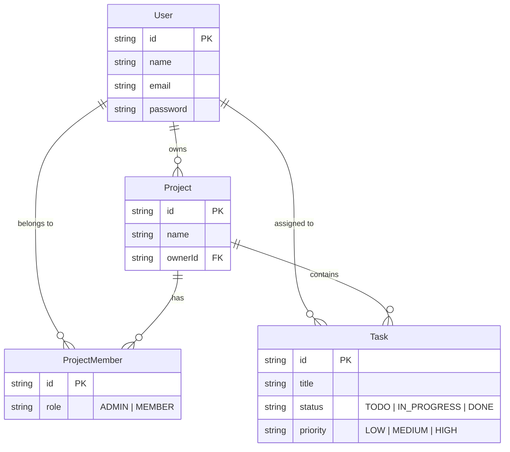

# 🚀 Team Task Manager


A full-stack, production-ready web application where teams can create projects, assign tasks, and track progress using a Kanban-style board. Features secure JWT authentication, rich analytics, and Role-Based Access Control (RBAC).

---

## ✨ Key Features

- **🔐 Authentication & Security:** Secure JWT-based auth with short-lived access tokens and automated refresh token rotation. Password hashing via bcrypt.
- **🛡️ Role-Based Access Control:** Strict authorization logic ensuring only `ADMIN` members can invite users, update project details, or delete tasks, while `MEMBER` users can only modify tasks assigned to them.
- **📊 Analytics Dashboard:** Real-time metrics overview displaying total tasks, pending workload, overdue task flags, and a chronological recent activity feed.
- **📋 Kanban Project Boards:** Dynamic task boards organized into `TODO`, `IN_PROGRESS`, and `DONE` statuses with priority tagging and due dates.
- **💎 Premium UI/UX:** A state-of-the-art dark mode interface built with Tailwind CSS, utilizing glassmorphism, fluid micro-animations, and responsive design.

---

## 🛠️ Tech Stack & Architecture

### **Frontend (Client)**
- **Framework:** React + Vite (Fast compilation, optimized builds)
- **Language:** TypeScript (Strict type safety across the board)
- **Styling:** Tailwind CSS v3 (Custom design system, CSS variables)
- **State Management:** Zustand (Lightweight global store)
- **Data Fetching:** Axios (Configured with automatic token refresh interceptors)
- **Icons:** Lucide React

### **Backend (API)**
- **Runtime:** Node.js
- **Framework:** Express.js (RESTful API architecture)
- **Language:** TypeScript
- **Database:** PostgreSQL
- **ORM:** Prisma (Type-safe database client and migrations)
- **Validation:** Zod (Strict schema validation for all incoming requests)

---

## 🗄️ Database Schema Overview



---

## 📂 Project Structure

This repository is structured as a monorepo containing both the frontend and backend applications.

```text
📦 Team-Task-Manager
 ┣ 📂 backend/               # Node.js API server
 ┃ ┣ 📂 prisma/              # DB schema & migrations
 ┃ ┣ 📂 src/                 
 ┃ ┃ ┣ 📂 controllers/       # Route logic handler
 ┃ ┃ ┣ 📂 middleware/        # Auth, RBAC, Error Handling
 ┃ ┃ ┣ 📂 routes/            # API route definitions
 ┃ ┃ ┣ 📂 utils/             # JWT, Response formatters
 ┃ ┃ ┗ 📜 app.ts             # Express setup
 ┃ ┗ 📜 tsconfig.json        # Strict TS config
 ┃
 ┗ 📂 frontend/              # React SPA
   ┣ 📂 src/
   ┃ ┣ 📂 api/               # Axios instance + interceptors
   ┃ ┣ 📂 components/        # Reusable UI components & Layout
   ┃ ┣ 📂 pages/             # Route-level views (Dashboard, Board)
   ┃ ┣ 📂 store/             # Zustand state (AuthStore)
   ┃ ┗ 📜 index.css          # Tailwind & Glassmorphism styles
   ┗ 📜 tailwind.config.js   # Custom design tokens
```

---

## 📡 Core API Endpoints

| Method | Endpoint | Access | Description |
|---|---|---|---|
| `POST` | `/api/auth/login` | Public | Authenticate user & receive JWT tokens |
| `POST` | `/api/auth/refresh` | Public | Rotate expired access tokens |
| `GET` | `/api/dashboard` | Auth | Fetch aggregated stats for dashboard |
| `GET` | `/api/projects` | Auth | List all projects for authenticated user |
| `POST` | `/api/projects/:id/tasks` | Admin | Create a new task in a project |
| `PATCH`| `/api/projects/:pId/tasks/:tId/status` | Auth | Update task status (Admin or Assignee) |

---

## 💻 Local Setup Instructions

### Prerequisites
- Node.js (v18+)
- PostgreSQL installed and running locally

### 1. Database Setup
Create a PostgreSQL database named `team_task_manager`.

### 2. Backend Setup
```bash
cd backend
npm install

# Create environment file
cp .env.example .env
# Ensure DATABASE_URL matches your local Postgres credentials in .env

# Run Prisma migrations
npx prisma migrate dev

# Start development server
npm run dev
```

### 3. Frontend Setup
Open a new terminal window:
```bash
cd frontend
npm install

# Create environment file
echo "VITE_API_URL=http://localhost:5000/api" > .env

# Start development server
npm run dev
```

---

## 🚀 Deployment (Railway)

This application is designed to be easily deployed on [Railway](https://railway.app/).

1. **Push to GitHub**: Push this complete monorepo to a single GitHub repository.
2. **Provision Database**: In Railway, create a new project and add a `PostgreSQL` plugin.
3. **Deploy Backend:**
   - Deploy from your GitHub repo, setting the Root Directory to `/backend`.
   - Set Build Command: `npm install && npm run build`
   - Set Start Command: `npx prisma db push && npm start`
   - Add environment variables: `MY_DB_URL` (from Postgres plugin), `FRONTEND_URL`, `JWT_SECRET`, `JWT_REFRESH_SECRET`, `PORT=5000`.

4. **Deploy Frontend:**
   - Deploy from the same GitHub repo, setting the Root Directory to `/frontend`.
   - Set Build Command: `npm install && npm run build`
   - Add environment variable: `VITE_API_URL` pointing to your newly created Railway backend's public URL.
   - Railway will automatically detect Vite and host it as a highly optimized static site.

---
*Developed with focus on scalability, type safety, and premium user experience.*
